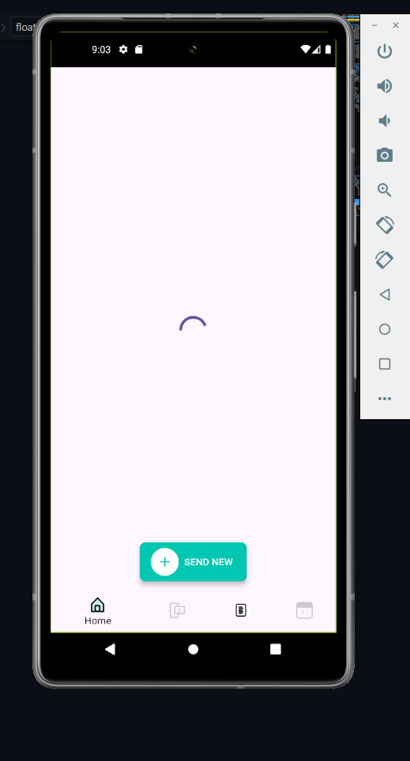
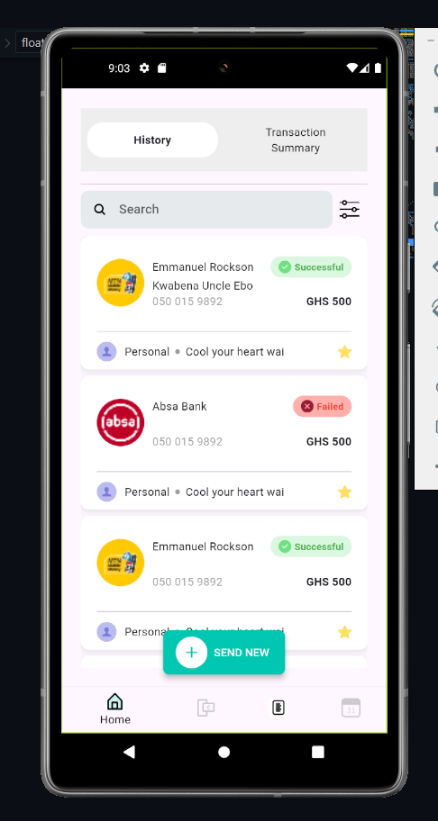

# Hubtel Coding Challenge

This repository contains the source code for the Hubtel Coding Challenge, a Flutter project designed to showcase a variety of Flutter development techniques and best practices.

## Overview

The project aims to demonstrate the implementation of a modern, responsive UI/UX design in Flutter, along with the integration of various Flutter packages and APIs. It serves as a practical example for developers looking to enhance their Flutter development skills.


## Getting Started

To get started with this project, clone the repository and ensure you have Flutter installed on your machine.


## Screenshots to the App



```bash
git clone https://github.com/yourusername/hubtel_coding_challenge.git
cd hubtel_coding_challenge
flutter pub get
flutter run